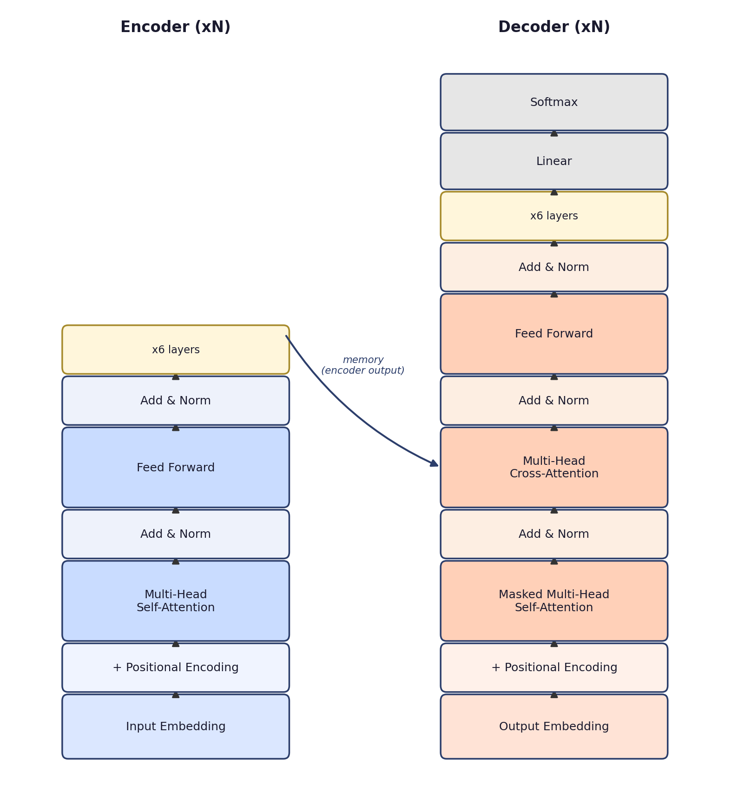
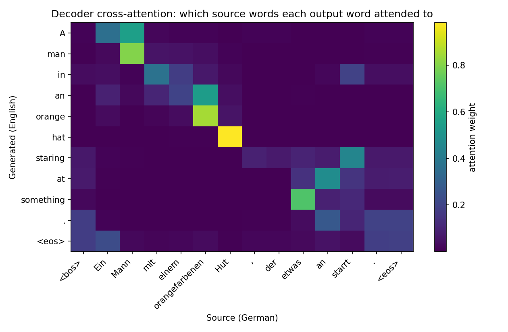
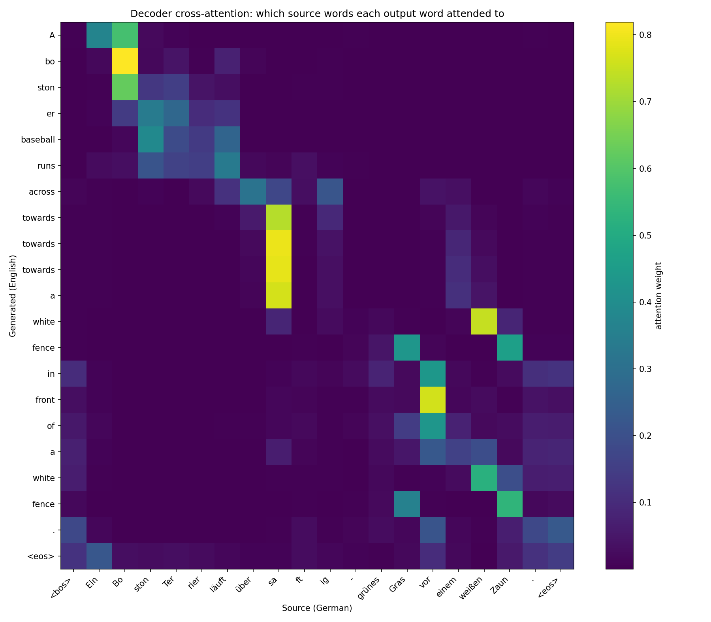

# Transformer from Scratch: "Attention Is All You Need"

A from-scratch PyTorch reimplementation of the Transformer architecture from
Vaswani et al., 2017 ("Attention Is All You Need"), trained on Multi30k
(German → English translation), with every component unit-tested against
hand-computed examples from the paper.

## Architecture

Faithfully implements Section 3 of the paper:

- Scaled dot-product attention and multi-head attention (Section 3.2)
- Position-wise feed-forward network (Section 3.3)
- Learned embeddings scaled by √d_model, plus fixed sinusoidal positional
  encoding (Sections 3.4–3.5)
- Residual connections + LayerNorm around every sub-layer (Section 3.1)
- 6-sublayer-per-side encoder/decoder stack, with masked self-attention,
  cross-attention, and causal + padding masking



*Original architecture diagram: Figure 1 in [Vaswani et al., 2017](https://arxiv.org/abs/1706.03762)*

## Hyperparameters: paper vs. this project

The **architecture code** matches the paper exactly. The **hyperparameters**
below are scaled down from the paper's base config, since this project trains
on Multi30k (~29K sentence pairs) on a single free-tier GPU, versus the
paper's WMT 2014 (~4.5M pairs) on 8 GPUs for 12 hours. Using the paper's full
512d/6-layer/65M-parameter config on data this size would be slow to train
and prone to overfitting.

| | Paper (base) | This project |
|---|---|---|
| d_model | 512 | 256 |
| Layers (N) | 6 | 3 |
| d_ff | 2048 | 1024 |
| Heads (h) | 8 | 8 |
| Warmup steps | 4000 | 1000 |
| Dropout | 0.1 | 0.1 |
| Label smoothing | 0.1 | 0.1 |
| Dataset | WMT 2014 (~4.5M pairs) | Multi30k (~29K pairs) |
| Hardware | 8× P100, 12h | 1 Colab GPU, ~8 min |

## Results

Trained for 20 epochs; best checkpoint at epoch 16 (validation loss 1.563),
mild overfitting afterward as training loss kept improving while validation
loss plateaued.

**BLEU (beam search, beam size 4, length penalty α=0.6), full 1000-sentence
Multi30k test set:**

| | BLEU |
|---|---|
| This project (Multi30k) | **38.86** |
| Paper, Transformer-base (WMT 2014 EN-DE) | 27.3 |

**These numbers are not directly comparable.** Multi30k sentences are short,
simple, repetitive image captions; WMT is diverse news-domain text. The
higher score here reflects an easier dataset, not a better model.

### Sample translations

| German | Reference | Model output |
|---|---|---|
| Ein Mann mit einem orangefarbenen Hut, der etwas anstarrt. | A man in an orange hat starring at something. | A man in an orange hat staring at something. |
| Ein Mädchen in einem Karateanzug bricht ein Brett mit einem Tritt. | A girl in karate uniform breaking a stick with a front kick. | A girl in a karate uniform takes a board with a kick. |
| Ein Boston Terrier läuft über saftig-grünes Gras vor einem weißen Zaun. | A Boston Terrier is running on lush green grass in front of a white fence. | A bo ston team runs on towards towards on towards towards a white fence in front of a white fence. |

The last example shows a **repetition loop**, a known beam search failure
mode. Here it's likely triggered by "Boston" being split into unusual
subword pieces ("bo" + "ston") by the small 8000-token BPE vocabulary,
throwing the decoder off track mid-sentence.

### Attention heatmap

**Clean translation** (the "orange hat" example):


**Repetition failure case** (the "Boston Terrier" example, note the unusual
subword split of "Boston" into "Bo ston Ter rier"):


Cross-attention from the last decoder layer: each row is a generated English
word, each column a source German word, brighter = more attention. Roughly
diagonal patterns indicate the model is attending to the corresponding
source word when generating each output word, as expected for translation.

### Ablation: number of attention heads

Run on the toy copy task rather than full retraining (faster iteration,
mirrors the paper's Table 3 approach of varying one hyperparameter at a time):

| Heads | Final loss | Copy accuracy |
|---|---|---|
| 1 | 0.0556 | 98.50% |
| 2 | 0.0138 | 99.50% |
| 4 | 0.0157 | 99.00% |
| 8 | 0.0266 | 99.50% |

h=1 has the lowest accuracy of the four, consistent in direction with the
paper's finding that fewer heads hurt performance, but the gap is much
smaller here. Likely explanation: the copy task doesn't require much
relational reasoning between positions, so even a single head can mostly
solve it, unlike real translation.

## Project structure

```
model/        core architecture (attention, encoder, decoder, embeddings, etc.)
training/     data pipeline, optimizer/LR schedule, loss, training loop, ablation
evaluation/   decoding (greedy/beam), BLEU scoring, attention visualization
tests/        unit tests for every module, including hand-computed examples
configs/      hyperparameter config (base.yaml)
heatmaps/     saved attention heatmap images
```

## Reproducing this

**Setup:**
```bash
pip install -r requirements.txt
```

**Run tests** (from repo root):
```bash
python -m tests.test_attention
python -m tests.test_feedforward
# ... etc, one per module in tests/
```

**Train** (needs GPU, e.g. Colab):
```bash
python -m training.train
```

**Evaluate BLEU:**
```bash
python -m evaluation.evaluate --checkpoint checkpoints/epoch16.pt --beam_size 4
```

**Visualize attention:**
```bash
python -m evaluation.attention_viz --checkpoint checkpoints/epoch16.pt --sentence "Ein Mann läuft."
```

**Run the head-count ablation** (fast, runs locally on CPU):
```bash
python -m training.ablation
```

## What this project demonstrates

- Every formula in Section 3 of the paper, implemented and verified against
  hand-computed numerical examples (not just shape checks)
- A toy copy-task sanity check used to catch architecture bugs before
  investing in real training
- Honest, explicit reasoning about where and why hyperparameters were scaled
  down from the paper, rather than silently using mismatched numbers
- A real trained model, a real BLEU score, and an honest discussion of both
  its strengths (fluent short sentences) and failure modes (repetition
  looping on unusual subword splits)
